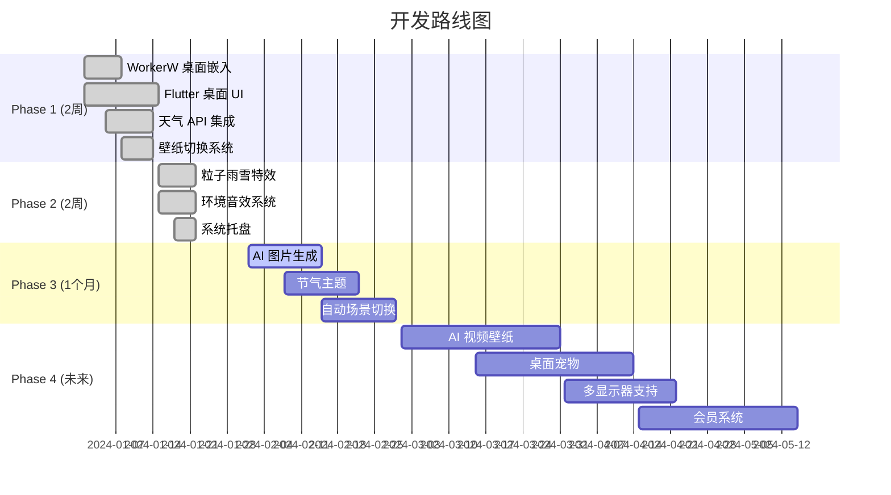

# 🌤️ AI Weather Wallpaper

> **AI 天气壁纸** — 一款 Windows 动态桌面壁纸应用，实时响应天气变化，AI 驱动的动态场景。
>
> A dynamic desktop wallpaper application for Windows — weather-responsive,
> AI-powered, and beautifully animated.

---

## 📖 简介 / Introduction

AI Weather Wallpaper 将你的 Windows 桌面变成一幅**活的画布**，它会根据真实天气实时变化：

- ☔ 窗外下雨 → 桌面落下雨滴，伴随雨声音效
- ❄️ 下雪 → 雪花飘落桌面，风声轻抚
- 🌙 晴朗夜空 → 星空闪烁，云层缓缓流动
- 🌅 日出日落 → 桌面色调随之变化
- 🤖 AI 生成 — 根据天气语义自动生成匹配的壁纸画面

---

## ✨ 特性 / Features

| 类别 | 特性 | 状态 |
|------|------|------|
| 🌦️ **天气联动** | 实时天气数据 (OpenWeather / 和风天气) | ✅ Phase 1 |
| 🖼️ **壁纸引擎** | 图片 / 视频 / Lottie / Shader 渲染 | ✅ Phase 1 |
| 🌧️ **粒子特效** | 雨、雪、云层、水波纹、极光 | ✅ Phase 2 |
| 🔊 **环境音效** | 雨声、海浪、森林、白噪音 | ✅ Phase 2 |
| 🖥️ **桌面嵌入** | WorkerW 窗口嵌入，图标下层显示 | ✅ Phase 1 |
| 🎯 **系统托盘** | 快捷菜单：暂停、切换、设置 | ✅ Phase 2 |
| 🤖 **AI 生成** | DALL·E / Stable Diffusion 壁纸生成 | 🔄 Phase 3 |
| 🌸 **节气主题** | 中国传统二十四节气自动切换 | 🔄 Phase 3 |
| 🎬 **AI 视频** | Sora / Runway 视频壁纸 | 📅 Phase 4 |
| 🐱 **桌宠** | 桌面互动宠物 | 📅 Phase 4 |
| 🖥️ **多显示器** | 多屏独立壁纸 | 📅 Phase 4 |

---

## 🏗️ 项目结构 / Project Structure

```
ai_weather_wallpaper/
├── apps/                               # 应用层 Application Layer
│   ├── desktop_app/                    # Flutter 桌面客户端 (main UI)
│   │   ├── lib/
│   │   │   ├── main.dart               # 入口 Entry point
│   │   │   ├── app.dart                # App 根组件 Root widget
│   │   │   ├── routes.dart             # 路由 + 占位页面 Routes + placeholder screens
│   │   │   └── bootstrap.dart          # 启动初始化 Bootstrap init
│   │   ├── assets/
│   │   ├── windows/
│   │   └── pubspec.yaml
│   └── admin_panel/                    # 未来云端管理后台 (Future)
│
├── packages/                           # 核心业务模块 Domain Packages
│   ├── weather_core/                   # 🌦️ 天气模块
│   │   ├── lib/models/                 # Weather, City, Forecast 模型
│   │   ├── lib/providers/              # OpenWeather / QWeather 数据源
│   │   └── lib/repository/             # Repository 统一接口
│   │
│   ├── wallpaper_core/                 # 🖼️ 壁纸引擎 (核心)
│   │   ├── lib/engine/                 # WallpaperEngine 生命周期管理
│   │   ├── lib/renderer/               # Image / Video / Lottie / Shader 渲染器
│   │   ├── lib/scene/                  # SceneManager 场景切换
│   │   └── lib/player/                 # MediaPlayer 媒体播放控制
│   │
│   ├── ai_engine/                      # 🤖 AI 模块
│   │   ├── lib/prompts/                # 25 种天气 Prompt 模板
│   │   ├── lib/image/                  # 图片生成 / 缓存 / 放大
│   │   ├── lib/video/                  # AI 视频生成 (Sora/Runway/Pika)
│   │   └── lib/llm/                    # LLM Prompt 优化服务
│   │
│   ├── audio_engine/                   # 🔊 环境音效系统
│   │   ├── lib/player/                 # 音频播放器
│   │   ├── lib/mixer/                  # 多音轨混音器
│   │   └── lib/effects/                # DSP 效果：混响、滤波器、均衡器
│   │
│   ├── desktop_bridge/                 # 🔗 Flutter ↔ Windows 桥接
│   │   ├── lib/channels/               # MethodChannel 通信
│   │   └── lib/ffi/                    # Win32 API FFI 绑定
│   │
│   ├── local_storage/                  # 💾 本地存储
│   │   ├── lib/sqlite/                 # SQLite (5 张表)
│   │   ├── lib/hive/                   # Hive KV 存储
│   │   └── lib/cache/                  # 带 TTL 的缓存管理
│   │
│   └── common_ui/                      # 🎨 公共组件
│       ├── lib/buttons/                # GlassButton 毛玻璃按钮
│       ├── lib/cards/                  # WeatherCard 天气卡片
│       ├── lib/dialogs/                # WallpaperDialog 壁纸选择
│       ├── lib/animations/             # SceneTransition 场景过渡动画
│       └── lib/themes/                 # AppTheme 深色主题
│
├── native/windows/                     # 🪟 Windows 原生层
│   ├── workerw/                        # 桌面 WorkerW 窗口嵌入 (Progman → SetParent)
│   ├── wallpaper_host/                 # 壁纸宿主窗口管理 (多显示器)
│   ├── ffmpeg_player/                  # FFmpeg 视频解码 + D3D11 渲染
│   ├── tray_manager/                   # 系统托盘图标 + 右键菜单
│   └── CMakeLists.txt                  # 原生模块构建配置
│
├── assets/                             # 📁 资源文件
│   ├── shaders/                        # GLSL 着色器 (water/rain/snow/cloud/aurora)
│   ├── images/                         # 静态图片
│   ├── videos/                         # 视频壁纸
│   ├── lottie/                         # Lottie 动画
│   ├── sounds/                         # 环境音效
│   └── weather/                        # 天气图标
│
├── docs/                               # 📄 文档
│   ├── architecture.md                 # 架构设计文档
│   ├── api.md                          # API 参考
│   └── database.md                     # 数据库表结构 + 缓存策略
│
├── scripts/                            # 🔧 自动化脚本
│   ├── build.ps1                       # Flutter Windows 构建
│   ├── release.ps1                     # 版本发布打包
│   └── package.ps1                     # 安装包生成 (ZIP / Inno Setup)
│
└── backend/                            # ☁️ 云端服务 (Future)
    ├── weather-service/                # 天气 API 代理 / 缓存
    └── ai-service/                     # AI 生成代理 / 会员服务
```

---

## 🧱 架构 / Architecture

```
┌─────────────────────────────────┐
│     Flutter Desktop UI          │  ← apps/desktop_app
│   (Wallpaper selection, tray,   │
│    settings, weather display)   │
└──────────────┬──────────────────┘
               │
               ▼
┌─────────────────────────────────┐
│     Wallpaper Engine            │  ← packages/wallpaper_core
│   (Scene management, renderer   │
│    lifecycle, FPS control)      │
└──────────────┬──────────────────┘
               │
               ▼
┌─────────────────────────────────┐
│     Desktop Bridge              │  ← packages/desktop_bridge
│   (MethodChannel + FFI)         │
└──────────────┬──────────────────┘
               │
               ▼
┌─────────────────────────────────┐
│     Windows Native Layer        │  ← native/windows/
│  (WorkerW → SetParent → Desktop)│
└─────────────────────────────────┘

         ┌──────┬──────┬──────┐
         │Weather│ AI   │Audio │  ← packages/*
         │Core   │Engine│Engine│
         └──┬────┴──┬───┴──┬───┘
            │       │      │
            ▼       ▼      ▼
         ┌──────────────────┐
         │  Local Storage   │  ← packages/local_storage
         │  SQLite + Hive   │
         └──────────────────┘
```

### 模块依赖关系 / Module Dependency

```
desktop_app
  ├── weather_core  ─── local_storage   (天气数据 → 缓存)
  ├── wallpaper_core ─ local_storage    (壁纸配置 → 持久化)
  ├── ai_engine     ─── local_storage   (AI 图片 → 缓存)
  ├── desktop_bridge                    (原生通信)
  ├── audio_engine                      (环境音效)
  └── common_ui                         (UI 组件)
```

---

## 🚀 快速开始 / Quick Start

### 前置条件 / Prerequisites

| 依赖 | 版本要求 |
|------|----------|
| Flutter SDK | ≥ 3.2.0 |
| Windows | 10/11 (x64) |
| Visual Studio | 2022 (C++ workload) |
| CMake | ≥ 3.14 (bundled with VS) |

### 安装 / Setup

```bash
# 1. 克隆仓库
git clone <repo-url>
cd ai_weather_wallpaper

# 2. 安装 Melos (Monorepo 管理工具)
dart pub global activate melos

# 3. 初始化所有包 (自动 pub get)
melos bootstrap

# 4. 运行桌面应用
cd apps/desktop_app
flutter run -d windows
```

### 构建发布版 / Build Release

```powershell
# 方式一：使用构建脚本
.\scripts\build.ps1

# 方式二：手动构建
cd apps\desktop_app
flutter build windows --release

# 打包为安装包
.\scripts\package.ps1 -Version 1.0.0 -Format zip
```

---

## 📦 包说明 / Package Guide

### weather_core — 天气模块

```
weather_core/
├── models/
│   ├── weather.dart        # WeatherModel {weather, temp, humidity, wind...}
│   ├── city.dart           # City {name, lat, lng, country}
│   └── forecast.dart       # Forecast + ForecastEntry
├── providers/
│   ├── weather_provider.dart       # 抽象接口
│   ├── openweather_provider.dart   # OpenWeatherMap 实现
│   └── qweather_provider.dart      # 和风天气实现
└── repository/
    └── weather_repository.dart     # Repository 模式，带 fallback
```

支持多数据源，主数据源失败自动切换到备用数据源。

### wallpaper_core — 壁纸引擎 (最核心)

```
wallpaper_core/
├── engine/wallpaper_engine.dart     # 单例引擎，管理壁纸生命周期
├── renderer/
│   ├── image_renderer.dart          # 静态图片壁纸 (PNG/JPG/BMP/WebP)
│   ├── video_renderer.dart          # 视频壁纸 (MP4/WebM/GIF/MOV)
│   ├── lottie_renderer.dart         # Lottie 动画壁纸
│   └── shader_renderer.dart         # GLSL Shader 实时渲染
├── scene/scene_manager.dart         # 场景切换管理 (淡入淡出等过渡)
└── player/media_player.dart         # 媒体播放控制
```

支持四种壁纸类型：图片、视频、Lottie 动画、GLSL Shader。

### ai_engine — AI 模块

```
ai_engine/
├── prompts/prompt_templates.dart    # 25 种天气 Prompt 模板
├── image/
│   ├── image_generator.dart         # 图片生成 (OpenAI/SD/Flux)
│   ├── image_cache.dart             # 生成结果缓存
│   └── image_upscaler.dart          # 图片超分放大
├── video/video_generator.dart       # AI 视频 (Sora/Runway/Pika/Kling)
└── llm/llm_service.dart             # LLM Prompt 优化
```

Prompt 模板支持中文场景描述替换，例如 `{location}`、`{timeOfDay}`。

### audio_engine — 环境音效

- **6 种内置音效**：Rain / Ocean / Forest / WhiteNoise / PinkNoise / BrownNoise
- **多音轨混音**：可同时播放雨声 + 风声
- **DSP 效果**：混响 (Reverb)、滤波器 (Filter)、均衡器 (EQ)

### desktop_bridge — Flutter ↔ Windows 桥接

- **MethodChannel**：`workerw` (嵌入)、`wallpaper` (壁纸)、`audio` (音效)、`overlay` (覆盖层)
- **FFI**：`FindWindowW`、`SetParent`、`SetWindowPos` 等 Win32 API

### local_storage — 本地存储

| 数据表 | 用途 | TTL |
|--------|------|-----|
| `weather_cache` | 天气缓存 | 30 min |
| `scene_cache` | 场景缓存 | 24 h |
| `ai_images` | AI 生成图片 | 7 d |
| `settings` | 应用设置 | — |
| `favorites` | 用户收藏 | — |

---

## 🗺️ 开发路线图 / Roadmap



| 阶段 | 时间 | 交付内容 |
|------|------|----------|
| **Phase 1** | 2 周 | ✅ WorkerW 嵌入、Flutter 界面、天气 API、壁纸切换 |
| **Phase 2** | 2 周 | ✅ 粒子雨雪、环境音效、系统托盘 |
| **Phase 3** | 1 个月 | 🔄 AI 图片生成、节气主题、自动场景 |
| **Phase 4** | 未来 | 📅 AI 视频壁纸、桌宠、多显示器、会员系统 |

---

## 🔧 技术栈 / Tech Stack

| 层 | 技术 | 用途 |
|----|------|------|
| UI 框架 | Flutter (Dart) | 桌面用户界面 |
| 状态管理 | Provider / Riverpod (TBD) | 响应式数据流 |
| 天气 API | OpenWeatherMap / QWeather | 实时天气数据 |
| 视频解码 | FFmpeg (libavcodec) | 视频壁纸播放 |
| 渲染 API | Direct3D 11 / OpenGL | GPU 加速渲染 |
| 桌面嵌入 | Win32 API (WorkerW) | 壁纸背景嵌入 |
| 本地存储 | SQLite + Hive | 持久化 + 缓存 |
| AI 生成 | OpenAI DALL·E / SD / Flux | 壁纸图片生成 |
| 音频 | WASAPI / custom mixer | 环境音效 |
| 构建工具 | Melos + CMake | Monorepo 编排 |
| 持续集成 | (TBD) | CI/CD |

---

## 📚 文档索引 / Documentation

| 文档 | 描述 |
|------|------|
| [架构设计](docs/architecture.md) | 模块架构、依赖关系、数据流 |
| [API 参考](docs/api.md) | 天气 API、AI 接口、平台通道 |
| [数据库设计](docs/database.md) | 表结构、索引、缓存策略 |

---

## 🤝 参与开发 / Contributing

### 开发规范

- Dart 代码遵循 `flutter_lints` 规则
- C++ 代码遵循 C++17 标准
- 所有公共 API 必须有文档注释
- 使用 Melos 进行跨包操作

### 常用命令

```bash
# 获取所有包依赖
melos get

# 代码分析
melos analyze

# 格式化代码
melos format

# 运行测试
melos test
```

---

## 📄 许可 / License

Proprietary — All rights reserved.

---

<p align="center">
  <sub>Built with ❤️ using Flutter · Dart · C++ · FFmpeg · GLSL</sub>
</p>
